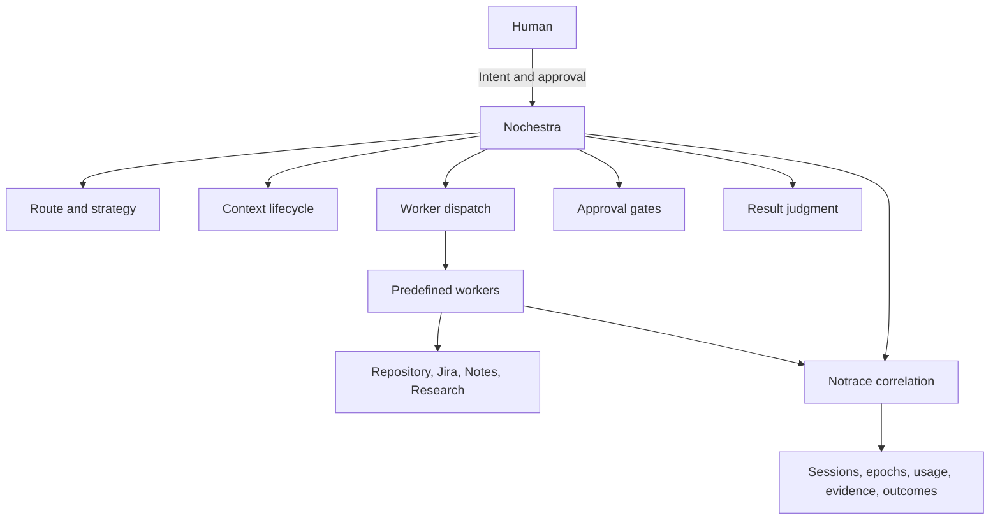
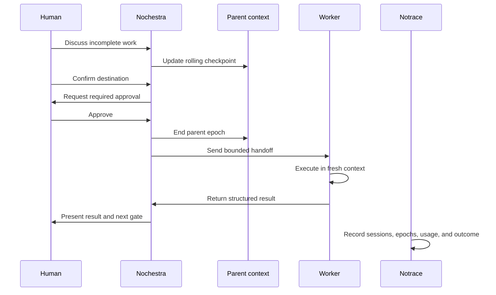

# Nochestra v1 Product and Architecture Brief

Status: Draft

Decision status used in this document:

1. **Accepted** means the boundary is required for v1.
2. **Provisional** means the direction is useful but must not become a permanent contract before implementation evidence exists.

This document is the durable product and architecture source for Nochestra v1. GitHub issues remain the delivery and project management source.

## Product summary

Nochestra is an optional control plane for Pi that lets a user begin with one natural conversation, then move into research, refinement, triage, writing, implementation, verification, or publication without manually rebuilding context.

The visible conversation may remain continuous. The model context must not remain one permanently growing prompt.

Nochestra coordinates the work. Predefined workers execute the work. Notrace observes what happened. The human approves consequential mutations.

## Problem

The existing workflow model is strong when the user already knows which hat to choose. Chat, Research, and RPIV each have clear boundaries and durable artifacts.

The gap appears before and between those workflows.

A user may start by discussing an incomplete Jira ticket, exploring a product decision, researching an unfamiliar area, or forming a plan. Later, the user may say `okay, triage`, `write this to my notes`, or `implement it`.

Without a control plane, several problems appear:

1. The user must manually choose and restart workflows.
2. Accepted decisions remain trapped in a long conversation.
3. A growing parent conversation is repeatedly sent to the model.
4. Workers may inherit irrelevant history.
5. Premium model access may be consumed before implementation begins.
6. Evidence is organized by individual sessions instead of the larger run and outcome.

Nochestra should make those transitions explicit, bounded, reviewable, and economical.

## Product promise

A user can begin by chatting naturally and later ask Nochestra to refine, triage, research, write, or deliver without manually rebuilding the entire conversation context.

Nochestra preserves accepted intent and decisions, recommends the next route, asks before consequential mutations, and dispatches a bounded worker with only the context needed for the assignment.

## Product principles

### One visible conversation, bounded model contexts

The user experience may be continuous while the active model context is divided into epochs.

Older raw conversation remains available for selective retrieval, but it is not automatically replayed into every later request.

### Semantic recommendation, deterministic activation

Nochestra may recommend a route based on the conversation. It must not silently change durable state or begin consequential work.

Existing deterministic commands remain valid:

```text
pi --rpiv
pi --research
pi --notes
```

Nochestra is initially activated explicitly:

```text
pi --nochestra
```

### Durable artifacts over transcript replay

Workers receive current artifacts and accepted decisions rather than a complete conversation transcript.

Examples include:

1. Jira snapshot
2. `WORK.md`
3. `RESEARCH.md`
4. Approved plan
5. Note draft
6. Verification evidence

### Human approval before consequential mutations

Nochestra may inspect, recommend, and prepare. Human approval is required before mutations to Jira, notes, repository files, commits, pushes, merge requests, or publication targets.

### Smallest sufficient scarce context

Nochestra should spend premium context where judgment and implementation quality matter. Deterministic discovery, local verification, and compact worker results should happen before additional premium calls where practical.

## Primary user journeys

### Conversational refine then triage

1. The user discusses an incomplete Jira ticket.
2. Nochestra maintains a rolling checkpoint of accepted decisions, constraints, and open questions.
3. The user says `okay, triage`.
4. Nochestra treats triage as the destination and checks prerequisites.
5. When conversation evidence resolves the missing ticket details, Nochestra proposes a Jira update.
6. The human approves the Jira mutation.
7. Nochestra starts a fresh bounded triage worker.
8. The worker creates or updates the execution artifact.
9. The parent presents the result and next approval.

The user should not need to repeat decisions already accepted in the conversation.

### Research then durable note

1. The user asks a broad or uncertain question.
2. Nochestra dispatches a bounded research worker.
3. The worker produces a compact evidence artifact.
4. A fresh synthesis or writing worker receives the evidence artifact, not the full research transcript.
5. The human reviews the proposed note mutation.
6. The approved note becomes durable knowledge.

### Direct deterministic workflow

1. The user starts `pi --rpiv`, `pi --research`, or `pi --notes` directly.
2. The existing workflow remains authoritative.
3. Nochestra is not required for the workflow to function.
4. Notrace may still observe the session independently.

## Responsibility model



### Human

The human provides intent, resolves genuine product decisions, and approves consequential mutations.

### Nochestra

Nochestra is the foreman and control plane.

It may:

1. Inspect the workspace and current workflow state.
2. Maintain compact accepted intent.
3. Recommend a route and strategy.
4. Select a predefined worker and runtime.
5. Build a bounded handoff.
6. Request approval.
7. Supervise progress.
8. Judge structured results.
9. Decide whether another attempt is justified.

It must not directly edit repository or note content in v1.

### Workers

Workers execute assignments.

A worker is composed from:

```text
role
selected skills
permissions
model policy
runtime
bounded assignment
```

Initial reusable roles are provisional:

1. Scout
2. Shaper
3. Implementer
4. Verifier
5. Integrator
6. Writer

V1 should prove one or two predefined workers before broadening this catalog.

### Notrace

Notrace observes and records evidence. It does not decide routes, context boundaries, approvals, retries, or model selection.

Notrace should correlate Nochestra runs, worker sessions, context epochs, model usage, tool activity, verification, and accepted outcomes.

## Context epoch model

A context epoch is one bounded period of active model memory for a parent or worker.

An epoch may end when:

1. A rolling checkpoint replaces older active history.
2. Pi compacts the session.
3. Nochestra changes route.
4. Work is handed to a fresh worker.
5. The model or runtime changes.
6. The session ends.

An epoch is a context boundary, not a new durable transcript format.



### Rolling checkpoint

The parent maintains one replaceable checkpoint containing the current truth:

```json
{
  "subject": "Jira ABC-123",
  "goal": "Prepare and deliver the ticket",
  "decisions": [],
  "constraints": [],
  "openQuestions": [],
  "rejectedOptions": [],
  "currentRoute": "chat",
  "suggestedNextRoute": "refine-then-triage"
}
```

Each checkpoint replaces the previous active checkpoint. Checkpoints must not accumulate into another replayed transcript.

The complete conversation may remain archived for recovery and selective retrieval.

### Hot, warm, and cold context

#### Hot context

Sent to the active model:

1. Current instructions
2. Latest rolling checkpoint
3. Recent relevant turns
4. Current task material
5. Current approvals
6. Immediate next decision

#### Warm state

Stored durably and loaded only when relevant:

1. `WORK.md`
2. `RESEARCH.md`
3. Jira snapshot
4. Approved plan
5. Current diff
6. Verification evidence
7. Durable notes

#### Cold archive

Preserved but never sent automatically:

1. Full transcripts
2. Previous epoch contents
3. Raw worker logs
4. Full debug traces
5. Superseded research evidence

### Worker handoff

A worker receives a bounded task packet rather than the parent transcript.

A handoff may contain:

```text
assignment
current artifact snapshot
accepted decisions
constraints
open questions
selected skills
permissions
context budget
result schema
```

Worker results should be compact and structured. A provisional result shape is:

```json
{
  "status": "completed",
  "outcome": "",
  "changedFiles": [],
  "verification": [],
  "decisions": [],
  "risks": [],
  "questions": [],
  "needsApproval": false
}
```

This shape is illustrative and does not establish the final public protocol.

## Routes

The following route model is accepted at the product level and provisional at the implementation level.

### Chat

Discussion only. No durable writes or workflow mutation.

### Notes

Durable knowledge writing and revision.

### Discovery

Research handles bounded investigation. Wayfinder may later handle long horizon discovery where the destination is visible but the path remains unclear.

### Delivery

Fast handles bounded, reversible, clear work. RPIV handles high risk, cross cutting, formally reviewed, or materially unclear work.

The final route classifier and thresholds remain provisional.

## Approval gates

V1 uses three conceptual gates:

### Route gate

The human confirms a transition from discussion into a durable workflow when the transition is not already explicit.

### Write gate

The human approves mutations to Jira, notes, or repository files.

### Publish gate

The human approves commits, pushes, merge requests, releases, or external publication.

Read only inspection and deterministic local verification do not require approval unless a tool or environment introduces another safety boundary.

## Runtime and concurrency boundaries

V1 should use a flat worker topology.

Accepted boundaries:

1. One shared checkout writer at a time.
2. Premium model concurrency defaults to one.
3. Read only workers may run in parallel when their runtime is safe.
4. Verification should prefer deterministic local tools before another premium judgment call.

Provisional runtime options include host execution, subscription backed CLI runtimes, local command verification, remote Mac execution for iOS, and later sandbox runtimes.

Sandcastle, Docker sandboxing, nested workers, peer communication, and worktree orchestration are outside v1.

## Compatibility and rollout

Nochestra begins as an optional feature.

```text
pi --nochestra
```

The first rollout must preserve:

1. Plain Pi behavior
2. `pi --rpiv`
3. `pi --research`
4. `pi --notes`
5. Existing workflow state and artifacts

Promoting Nochestra to the default Pi entry point is a separate potentially breaking decision.

Changing Notrace from full payload capture to metadata capture by default is a separate behavioral compatibility decision and must include an explicit full debug mode and release note.

## V1 scope

V1 should prove the smallest useful vertical slice:

1. Optional Nochestra parent
2. Compact capability catalog
3. Rolling checkpoint
4. Context epoch transition
5. One bounded predefined worker handoff
6. One writer lock for the shared checkout
7. Human approval gates
8. Compact worker result
9. Minimal Notrace correlation and accounting
10. Jira refine then triage as the first end to end journey
11. Kotlin aware repository inspection and deterministic verification where relevant

## Non goals

V1 does not include:

1. Arbitrary agent generation
2. Generic workflow graph engine
3. Permanent domain packs
4. Nested worker hierarchies
5. Peer to peer worker communication
6. Worktree orchestration
7. Swarm execution
8. Mandatory Sandcastle or Docker runtime
9. Full Notrace analytics UI
10. Universal cross harness memory protocol
11. Nochestra as the default Pi entry point
12. A final public worker or runtime API

## Success measures

V1 succeeds when evidence shows:

1. A user can discuss work and later enter triage without restating accepted decisions.
2. A fresh worker can complete its assignment without the full parent transcript.
3. Older parent epochs are not automatically replayed.
4. Parent and worker context usage is measurable separately.
5. The user retains approval over consequential mutations.
6. Existing deterministic workflows continue to operate.
7. Notrace can correlate useful outcomes without storing giant repeated payloads by default.
8. The first vertical slice produces a verified artifact and a compact evidence trail.

Exact context thresholds, quota policies, and target token counts require measurement and remain provisional.

## Issue map

### Nochestra track

1. [#74: Introduce context epochs and bounded worker handoffs](https://github.com/raquezha/nothing/issues/74)
2. [#76: Create v1 product brief and architecture map](https://github.com/raquezha/nothing/issues/76)

Issue #74 should operate as the Nochestra tracking issue after smaller executable children are created.

### Notrace track

1. [#56: Session anchored Notrace capture architecture](https://github.com/raquezha/nothing/issues/56)
2. [#75: Metadata capture and epoch tracing](https://github.com/raquezha/nothing/issues/75)

Issue #56 is the Notrace architecture track. Issue #75 is related implementation work and should be split so that the urgent metadata safety change can ship independently from epoch tracing and storage redesign.

## Suggested executable issue sequence

### Nochestra

1. Define v1 boundaries and compatibility contract
2. Measure active and cumulative context usage
3. Maintain a rolling checkpoint
4. Start a bounded parent context epoch
5. Dispatch one predefined worker with a bounded handoff
6. Prove conversational Jira refine then triage

### Notrace

1. Default to metadata and stop provider payload duplication
2. Capture Pi compaction and epoch boundaries
3. Correlate Nochestra runs, workers, sessions, and epochs
4. Replace embedded per session reports with compact storage
5. Add retention and legacy trace cleanup

Each executable issue should state outcome, scope, acceptance criteria, non goals, what it does not establish, rollback, and evidence produced.

## Open decisions

1. Where the rolling checkpoint lives during the first implementation
2. Whether the parent checkpoint is maintained deterministically, by a model, or by a hybrid
3. Which single worker role proves the first bounded handoff
4. How Nochestra receives provider and subscription usage signals
5. Which Pi hooks expose enough compaction detail for reliable epoch observation
6. Which Jira adapter and approval UX form the first vertical slice
7. How archived conversation retrieval is indexed without becoming automatic replay
8. Whether Notes is a first class route in the first release or a later vertical slice

## Decision log

| Date | Decision | Status | Reason |
| --- | --- | --- | --- |
| 2026 08 06 | Nochestra controls routing, context lifecycle, dispatch, and approval requests | Accepted | Keeps policy in one control plane |
| 2026 08 06 | Workers execute bounded assignments | Accepted | Prevents the foreman from becoming an unrestricted editor |
| 2026 08 06 | Notrace observes and measures but does not orchestrate | Accepted | Preserves a clean evidence boundary |
| 2026 08 06 | Older epoch content is not automatically replayed | Accepted | Controls cumulative input and irrelevant context |
| 2026 08 06 | One shared checkout writer operates at a time | Accepted | Avoids conflicting writes without requiring worktrees |
| 2026 08 06 | Consequential mutations require human approval | Accepted | Preserves user control and reversibility |
| 2026 08 06 | Nochestra starts as `pi --nochestra` | Accepted for v1 | Preserves existing workflow behavior during rollout |
| 2026 08 06 | Worker roles begin with Scout, Shaper, Implementer, Verifier, Integrator, and Writer | Provisional | Useful catalog, not yet proven as the smallest set |
| 2026 08 06 | Parent tools include catalog search, workspace inspection, route proposal, worker lifecycle, and approval request | Provisional | Must be tested against the first vertical slice |
| 2026 08 06 | The first product proof is Jira refine then triage | Provisional | Strong end to end example with clear approval boundaries |
| 2026 08 06 | Context thresholds are configurable and chosen from measurement | Provisional | Technical windows and economic limits vary by provider and model |

## Does not establish

This document does not define:

1. The final cross harness protocol
2. A permanent storage format
3. The final public worker API
4. The final runtime adapter API
5. Exact context thresholds
6. Exact epoch identifiers
7. A universal memory framework
8. Default behavior outside the optional Nochestra entry point

Implementation details become accepted only after evidence, review, and an explicit decision update.