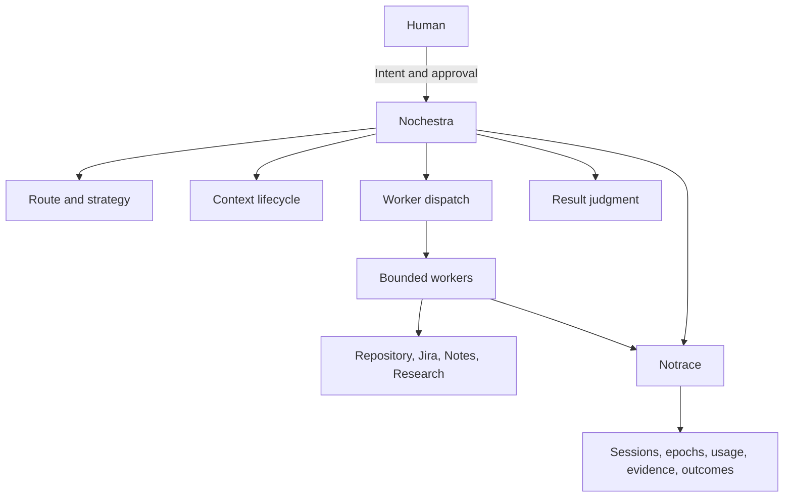
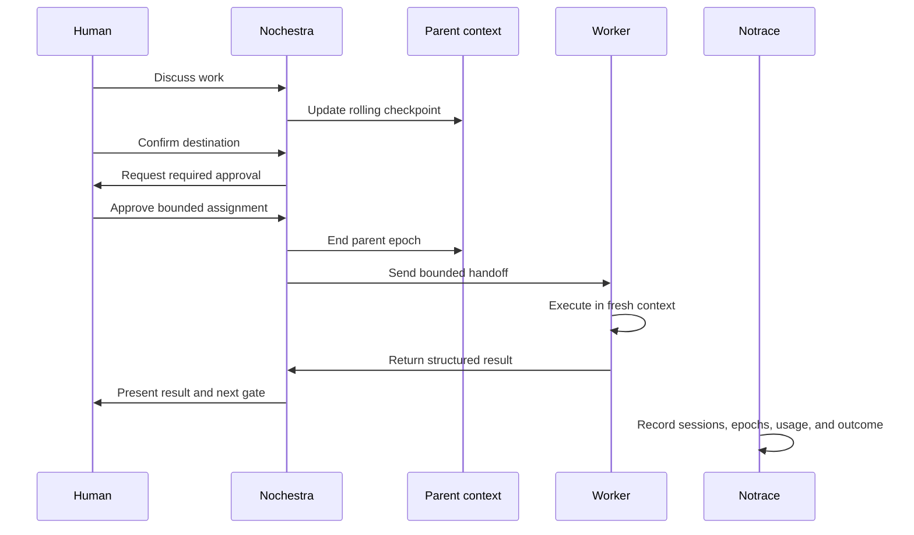

# Nochestra Product and Architecture Brief

Status: Draft

This document records the current product boundary for Nochestra. GitHub issues manage delivery. Decisions marked provisional must not become permanent contracts without implementation evidence.

## Product summary

Nochestra is an optional control plane for Pi.

It lets a user begin with a natural conversation and later move into research, notes, refinement, triage, implementation, verification, or publication without manually reconstructing useful context.

One visible conversation does not mean one permanently growing model prompt.

## Product promise

Nochestra preserves accepted intent and decisions, recommends the next route, asks for approval at meaningful boundaries, and dispatches a bounded worker with only the context required for the assignment.

## Existing workflow compatibility

Nochestra starts as an optional entry point:

```text
pi --nochestra
```

The initial rollout must preserve plain Pi, `pi --rpiv`, `pi --research`, `pi --notes`, existing `.workflow` state, and existing durable artifacts.

Making Nochestra the default Pi entry point is a separate potentially breaking decision.

## Responsibility model



### Human

The human provides intent, resolves genuine product decisions, and approves consequential transitions.

### Nochestra

Nochestra is the foreman. It may inspect workspace and workflow state, maintain compact accepted intent, recommend a route, build a bounded handoff, request approval, dispatch and supervise workers, and judge structured results.

Nochestra does not directly perform repository or note edits in the initial rollout.

### Workers

Workers execute bounded assignments.

The initial model only requires three conceptual roles:

1. Parent
2. Executor
3. Verifier

More specialized role names remain provisional until the first vertical slice proves they are useful.

### Notrace

Notrace observes and records evidence. It does not decide routes, context boundaries, approvals, retries, or model selection.

## Product routes

The initial product model uses four routes:

1. Chat: discussion with no durable mutation
2. Notes: durable knowledge writing and revision
3. Discovery: research and evidence gathering
4. Delivery: refinement, triage, implementation, verification, and synchronization

The route classifier and thresholds remain provisional.

## Approval model

Approval happens at meaningful boundaries, not before every individual tool call.

### Route approval

The human confirms a transition into a durable workflow when the destination was not already explicit.

### Write approval

The human authorizes a bounded write capable assignment, such as one approved RPIV implementation slice or one proposed Jira update.

After approval, the assigned worker may perform the bounded mutation without requesting permission for every individual file edit.

### Publish approval

The human approves commits, pushes, merge requests, releases, or external publication.

Read only inspection and deterministic local verification do not normally require approval.

## Context epoch model

A context epoch is one bounded period of active model memory for a parent or worker.

An epoch may end when:

1. A worker handoff starts a fresh context
2. An explicit route transition occurs
3. Pi compacts the session
4. The model or runtime changes
5. A configured context policy requires a safe boundary
6. The session ends

Nochestra must not silently continue beyond a configured economic or technical threshold. It may create a safe context boundary according to an explicit policy.

An epoch is a context boundary, not a new transcript format.



## Rolling checkpoint

The parent keeps one replaceable checkpoint containing current truth.

Illustrative fields:

```json
{
  "subject": "Jira ABC-123",
  "goal": "Prepare and deliver the ticket",
  "decisions": [],
  "constraints": [],
  "openQuestions": [],
  "rejectedOptions": [],
  "currentRoute": "chat",
  "suggestedNextRoute": "delivery"
}
```

Each checkpoint replaces the previous active checkpoint. Checkpoints must not accumulate into another replayed transcript.

The exact schema and storage location remain provisional.

## Hot, warm, and cold context

### Hot context

Sent to the active model:

1. Current instructions
2. Latest checkpoint
3. Recent relevant turns
4. Current task material
5. Current approvals
6. Immediate next decision

### Warm state

Stored durably and loaded when relevant:

1. `WORK.md`
2. `RESEARCH.md`
3. Jira snapshot
4. Approved plan
5. Current diff
6. Verification evidence
7. Durable notes

### Cold archive

Preserved but never sent automatically:

1. Full transcripts
2. Previous epoch contents
3. Raw worker logs
4. Full debug traces
5. Superseded research evidence

## Worker handoff

A worker receives a bounded task packet instead of the complete parent transcript.

A handoff may contain assignment, current artifact snapshot, accepted decisions, constraints, open questions, selected skills, permissions, context budget, and result schema.

Worker results should be compact and structured. The exact protocol remains provisional.

## Concurrency boundary

The initial rollout uses a flat topology.

Accepted boundaries:

1. One shared checkout writer at a time
2. Premium model concurrency defaults to one
3. Read only workers may run in parallel when safe
4. Deterministic verification should run before an additional premium judgment call where practical

Worktrees, nested workers, peer communication, swarm execution, and mandatory sandbox runtimes are outside the initial rollout.

## Primary vertical slice

The first proposed product proof is conversational Jira refinement followed by triage.

1. The user discusses an incomplete Jira ticket
2. Nochestra preserves accepted decisions
3. The user confirms triage as the destination
4. Nochestra checks prerequisites
5. Nochestra proposes any required Jira update
6. The human approves the Jira mutation
7. A fresh bounded triage worker starts
8. The worker creates or updates the RPIV execution artifact
9. The parent presents the result

This vertical slice remains provisional until its implementation issue is accepted.

## Initial scope

The first rollout should prove:

1. Optional Nochestra parent
2. Rolling checkpoint
3. Context epoch transition
4. One bounded executor handoff
5. One shared writer lock
6. Human approval gates
7. Compact worker result
8. Parent and worker context accounting
9. Minimal Notrace correlation
10. One complete vertical slice

## Non goals

The initial rollout does not include arbitrary agent generation, a generic workflow graph engine, permanent domain packs, nested worker hierarchies, peer to peer worker communication, worktree orchestration, swarm execution, mandatory Sandcastle or Docker execution, a full Notrace analytics UI, a universal cross harness memory protocol, Nochestra as the default Pi entry point, or a final public worker or runtime API.

## Success measures

The initial rollout succeeds when evidence shows:

1. A user can move from discussion into a durable workflow without restating accepted decisions
2. A fresh worker can complete its assignment without the full parent transcript
3. Older epochs are not automatically replayed
4. Parent and worker context usage is measured separately
5. The human retains control over consequential transitions
6. Existing deterministic workflows still operate
7. Notrace provides useful evidence without full repeated payload capture by default
8. The vertical slice produces a verified artifact and compact evidence trail

Exact context thresholds and quota policies require measurement.

## Issue map

Delivery management, active vertical slices, child tasks, and execution state are tracked in [GitHub Project: Nothing v2](https://github.com/users/raquezha/projects/3).

### Parent track issues

1. [#74](https://github.com/raquezha/nothing/issues/74): Nochestra parent product and delivery track
2. [#56](https://github.com/raquezha/nothing/issues/56): Notrace session-anchored architecture track
3. [#73](https://github.com/raquezha/nothing/issues/73): RPIV design and specification evidence gate track

## Open decisions

1. Where the rolling checkpoint lives
2. Whether checkpoint maintenance is deterministic, model driven, or hybrid
3. Which executor proves the first bounded handoff
4. How provider and subscription usage signals are measured
5. Which Pi hooks expose reliable compaction boundaries
6. Which Jira adapter and approval interaction form the first vertical slice
7. How archived conversation retrieval works without automatic replay
8. Whether Notes belongs in the initial rollout or a later vertical slice

## Decision log

| Date | Decision | Status | Reason |
| --- | --- | --- | --- |
| 2026 08 06 | Nochestra controls routing, context lifecycle, dispatch, and approval requests | Accepted | Keeps policy in one control plane |
| 2026 08 06 | Workers execute bounded assignments | Accepted | Keeps the parent from becoming an unrestricted editor |
| 2026 08 06 | Notrace observes but does not orchestrate | Accepted | Preserves a clean evidence boundary |
| 2026 08 06 | Older epoch content is not automatically replayed | Accepted | Controls cumulative input and irrelevant context |
| 2026 08 06 | One shared checkout writer operates at a time | Accepted | Avoids conflicting writes without requiring worktrees |
| 2026 08 06 | Approval authorizes a bounded assignment rather than every individual edit | Accepted | Preserves control without making execution unusable |
| 2026 08 06 | Nochestra starts as `pi --nochestra` | Accepted for initial rollout | Preserves existing workflows during rollout |
| 2026 08 17 | Nochestra canonical local home is `packages/workflows/nochestra` | Accepted | Established in #94 as reversible workflow bundle scaffold |
| 2026 08 06 | The first product proof is Jira refine then triage | Provisional | Strong end to end example with clear approval boundaries |
| 2026 08 06 | Context thresholds are chosen from measurement | Provisional | Technical and economic limits vary by provider and model |

## Does not establish

This document does not define a release or version number for the Nochestra track, a final cross harness protocol, permanent storage format, final public worker API, final runtime adapter API, exact context thresholds, exact epoch identifiers, a universal memory framework, or default behavior outside the optional Nochestra entry point.

Implementation details become accepted only after evidence, review, and an explicit decision update.